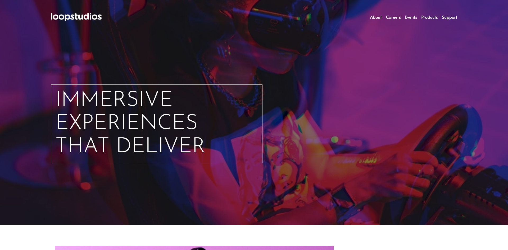

# Frontend Mentor - Loopstudios landing page solution

This is a solution to the [Loopstudios landing page challenge on Frontend Mentor](https://www.frontendmentor.io/challenges/loopstudios-landing-page-N88J5Onjw). Frontend Mentor challenges help you improve your coding skills by building realistic projects.

### The challenge

Users should be able to:

- View the optimal layout for the site depending on their device's screen size
- See hover states for all interactive elements on the page

### Screenshot

### Links

- Solution URL: [Add solution URL here](https://github.com/LucianEmanuel/Loopstodios-landing-page)
- Live Site URL: [Add live site URL here](https://lucianemanuel.github.io/Loopstodios-landing-page)

### Built with

- Semantic HTML5 markup
- CSS custom properties
- Flexbox
- CSS Grid
- Mobile-first workflow
- [Alpine JS](https://alpinejs.dev/start-here) - JS library

## Author

- Website - [LucianEmanuel](https://github.com/LucianEmanuel)
- Frontend Mentor - [@LucianEmanuel](https://www.frontendmentor.io/profile/LucianEmanuel)
